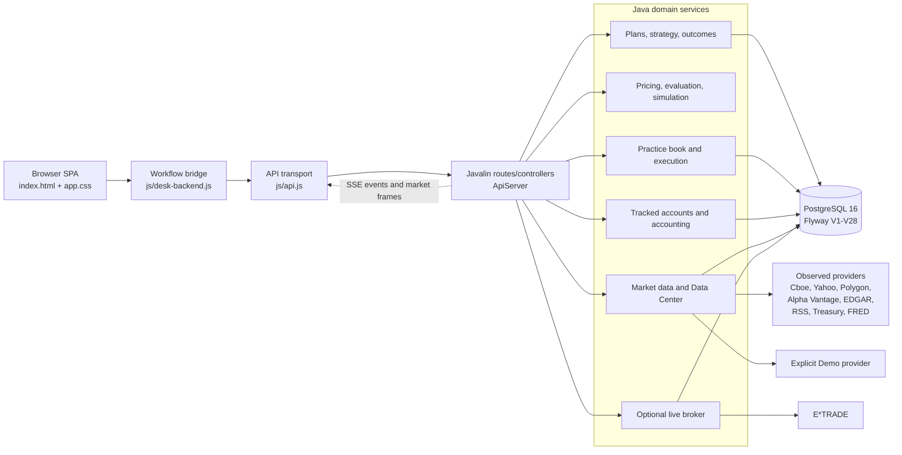
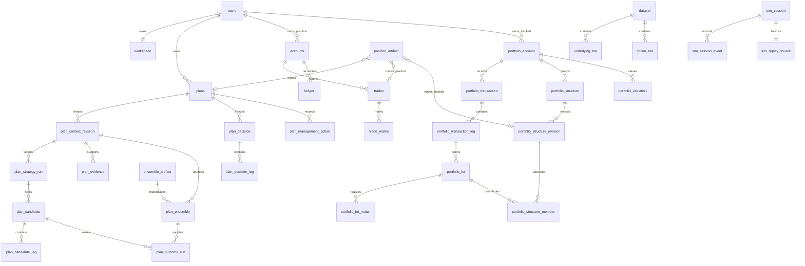
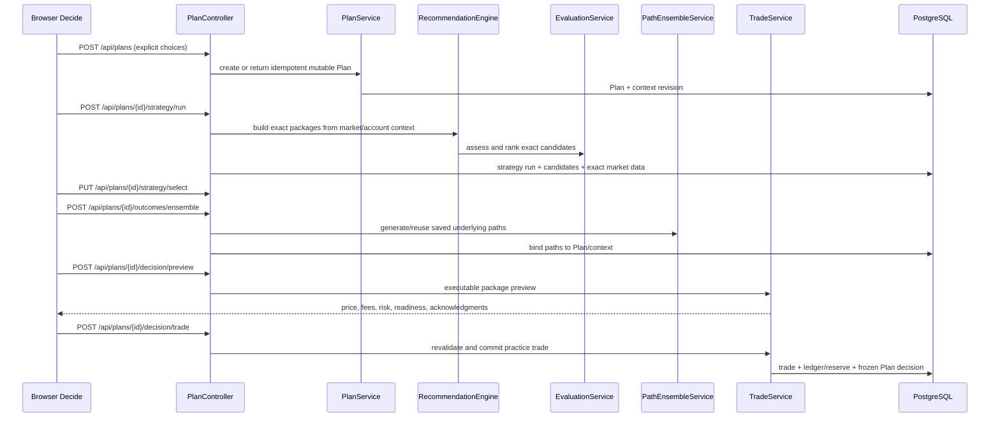
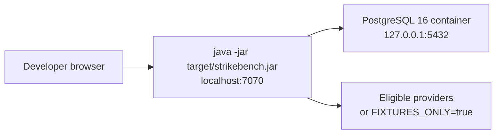
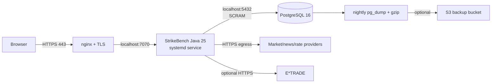

# StrikeBench Architecture

Current-code guide verified against `feature/journey_refactor` on 2026-08-01.

StrikeBench is a local-first options education, analysis, paper-trading, tracked-account,
backtesting, and optional live-broker application. It is intentionally a **modular Java
monolith**, not a collection of networked microservices: one process owns the HTTP API, domain
services, background work, and the browser application; PostgreSQL is the durable system of
record.

This document explains the current implementation. It does not describe retired pages, old API
aliases, or `workspace.html`.

### Reading map

- Start with **Architecture at a glance** and **Principal data flows** to understand the product.
- Use **Java components and responsibilities** to find the service responsible for behavior you need to change.
- Use **PostgreSQL data model** and **HTTP API** to trace persistence and request/response formats.
- Use **External providers**, **Background work**, and **Infrastructure** for operational work.
- Before adding a path, consult **How to extend StrikeBench without creating parallel paths**.

## 1. Architecture at a glance



The most important boundaries are:

1. **Java owns financial facts.** The browser formats and draws typed server results. It does not
   price options, calculate POP/EV/Greeks, generate paths, or reconstruct payoff facts.
2. **Market modes do not silently mix.** `OBSERVED`, `DEMO`, `SIMULATED`, and `SCENARIO` are explicit.
   Demo data never fills a hole in Observed.
3. **A Plan is the durable saved-idea record.** Its context, strategy results, market data,
   possible futures, replay, decision, and management records remain tied to exact revisions and inputs.
4. **Practice and tracked books are separate.** Practice mutations affect practice cash/reserves;
   tracked transactions affect external-account accounting. Neither ledger impersonates the other.
5. **Missing data remains missing.** Unavailable quotes, marks, events, or probabilities do not
   become zero or a hidden default.
6. **Commands are idempotent and user-scoped.** User identity, market identity, input hashes,
   and request keys prevent stale or duplicate mutations from being accepted as new work.

### Data quality metadata

Financial and market results include the metadata needed to interpret them: source, observation
time, market mode, completeness, fees, inputs, model version, and an input hash when identity
matters. A result can be current, stale, modeled, or unavailable. This metadata explains a value;
it is not a second calculation or an additional permission check.

Examples include `PackagePrice`, `PositionLifecycleAnalysis`, `GreeksView`, market-source metadata,
and the input hash for a saved set of possible futures. The UI presents the underlying facts in
plain language.

## 2. Runtime and composition

### Process startup

[`Main`](src/main/java/io/liftandshift/strikebench/Main.java) performs three tasks:

1. Preloads classes when running from the shaded jar, so replacing the jar beneath a live JVM
   cannot wedge later lazy class loading.
2. Reads [`AppConfig`](src/main/java/io/liftandshift/strikebench/config/AppConfig.java).
3. Calls [`ApiServer.create`](src/main/java/io/liftandshift/strikebench/api/ApiServer.java), then
   starts Javalin on `PORT` (7070 by default).

The same jar also exposes the deliberate `ingest-options` CLI for licensed historical-option CSV
data. Normal application startup does not invoke that path.

### Composition root

[`ApiServer`](src/main/java/io/liftandshift/strikebench/api/ApiServer.java) is the composition root.
It:

- opens the HikariCP PostgreSQL pool and runs Flyway;
- mounts observed providers and the isolated Demo provider;
- creates the market, recommendation, evaluation, Plan, outcome, simulation, book, accounting,
  broker, data-job, workspace, event, and alert services;
- creates controllers and registers their routes;
- serves the SPA from the jar;
- applies authentication, authorization, telemetry, and typed error handling; and
- starts background refresh, snapshot, valuation, sync, and retention work.

Domain services do not start their own HTTP servers. Controllers translate HTTP requests into
typed domain calls; they should not become alternate calculators.

## 3. Browser application

There is no frontend build system. Javalin serves plain HTML, CSS, and JavaScript from
[`src/main/resources/public`](src/main/resources/public/).

| File | Responsibility |
|---|---|
| [`index.html`](src/main/resources/public/index.html) | Mounted shell, Book/Home composition, Position focus, Decide/New Idea, Import and Learn dialogs, rendering, interaction, and browser-history restoration. |
| [`app.css`](src/main/resources/public/app.css) | The single stylesheet, theme tokens, component geometry, and responsive composition. |
| [`js/api.js`](src/main/resources/public/js/api.js) | The only HTTP transport: JSON/error boundary, auth signaling, navigation cancellation, identity-keyed GET cache, mutation invalidation, upload, NDJSON streaming, and governed prefetch. |
| [`js/desk-backend.js`](src/main/resources/public/js/desk-backend.js) | The browser workflow bridge. It sequences the existing APIs and manages request generations for workspace, Plans, Book, Position, scenarios, drafts, imports, and Scout. |
| [`strategies.js`](src/main/resources/public/strategies.js) | Presentation metadata used by strategy/learning views; server catalog and server financial facts remain authoritative. |
| [`learn-content.js`](src/main/resources/public/learn-content.js), [`learn-shapes.js`](src/main/resources/public/learn-shapes.js) | Shared educational copy and visual teaching shapes. |

### Visible focus states

- **Book/Home:** account/cash context, market context, discovery/Scout, positions, working ideas,
  research, and book-level risk.
- **Position:** focused held package, durable payoff, current management data, scenarios, market
  context, legs, and position actions.
- **Decide/New Idea:** one Plan’s ranked candidates, exact legs, payoff, scenario spectrum,
  market data, possible futures, book fit, decision preview, replay, and commitment.
- **Import:** tracked-account manual entry and broker-statement workflow.
- **Learn:** the shared glossary and strategy teaching material.

Position and Decide are focus states in the same mounted document. They are not separate frontend
applications.

### Client state and cache rules

[`WorkspaceContext`](src/main/java/io/liftandshift/strikebench/db/WorkspaceContext.java) is the
server-owned persisted context for market identity, scope, focus, goal, view, horizon, risk,
assignment preference, earnings preference, and return focus.

The browser bridge retains one in-memory object for that context and serializes patches. Every
patch carries optimistic identity/revision guards; a conflict is re-read and retried once rather
than silently overwriting another tab.

`js/api.js` maintains a small 20-second, 40-entry GET cache. Every key includes the accepted market
identity. A market transition advances the cache generation and clears the old namespace, so an
Observed response cannot reappear in a simulated market or vice versa. Genuine mutations flush or
target-invalidate affected reads.

### Browser streaming

- `/api/market/stream` is Server-Sent Events for market frames.
- `/api/events` is Server-Sent Events for small typed hints (workspace, jobs, datasets, provider
  cooldowns, alerts). GET endpoints remain the source of truth after a hint.
- `/api/research/scout` returns newline-delimited JSON. `API.streamNdjson` publishes each completed
  result frame immediately instead of waiting for the full universe.

## 4. Java components and responsibilities

### HTTP and application boundary

| Component | Responsibility |
|---|---|
| [`ApiServer`](src/main/java/io/liftandshift/strikebench/api/ApiServer.java) | Dependency composition, Javalin setup, middleware, static files, exception mapping, and schedulers. |
| `*Routes` in [`api`](src/main/java/io/liftandshift/strikebench/api/) | Exhaustive route definitions grouped by domain. |
| `*Controller` in [`api`](src/main/java/io/liftandshift/strikebench/api/) | HTTP validation and response composition over domain services. |
| [`ApiResponses`](src/main/java/io/liftandshift/strikebench/api/ApiResponses.java) | Shared typed wire views and error bodies. |
| [`WorldTransitionService`](src/main/java/io/liftandshift/strikebench/api/WorldTransitionService.java) | Atomic simulated-market/dataset/account/workspace transition. |

### Market data and operations

| Component | Responsibility |
|---|---|
| [`MarketDataService`](src/main/java/io/liftandshift/strikebench/market/MarketDataService.java) | Ordered provider routing, the shared last-known quote cache, chain/history/news/rate caches, freshness checks, stored-data read-through, and provider/domain health. |
| [`MarketDataEngine`](src/main/java/io/liftandshift/strikebench/market/MarketDataEngine.java) | Warm/refresh orchestration, tracked-symbol scheduling, single-flight acquisition, and current frame composition. It does not create a second price authority. |
| [`MarketMode`](src/main/java/io/liftandshift/strikebench/market/MarketMode.java) | The definition of `OBSERVED`, `DEMO`, `SIMULATED`, and `SCENARIO` market modes. |
| [`EventService`](src/main/java/io/liftandshift/strikebench/market/EventService.java) | Earnings and ex-dividend data with source metadata. |
| [`DatasetService`](src/main/java/io/liftandshift/strikebench/db/DatasetService.java) | Observed/synthetic dataset registry and active dataset. |
| [`ObservedCandleWriter`](src/main/java/io/liftandshift/strikebench/db/ObservedCandleWriter.java), [`OptionBarWriter`](src/main/java/io/liftandshift/strikebench/db/OptionBarWriter.java) | Single validated SQL writers for underlying and option observations. |
| [`DataJobService`](src/main/java/io/liftandshift/strikebench/db/DataJobService.java), [`DataSyncScheduler`](src/main/java/io/liftandshift/strikebench/db/DataSyncScheduler.java) | Resumable operational work and once-per-completed-session history enrichment. |
| [`ProviderRequestBudget`](src/main/java/io/liftandshift/strikebench/db/ProviderRequestBudget.java) | Durable allowance shared by screens, jobs, and schedulers. |

Provider interfaces live in [`market/ports`](src/main/java/io/liftandshift/strikebench/market/ports/).
Provider implementations live in
[`market/providers`](src/main/java/io/liftandshift/strikebench/market/providers/). A provider adapter
may normalize an upstream format; it may not invent a different StrikeBench data model.

### Structure, pricing, recommendation, and evaluation

| Component | Responsibility |
|---|---|
| [`StrategyCatalog`](src/main/java/io/liftandshift/strikebench/strategy/StrategyCatalog.java) | Single server-owned family/template registry, recommendation disposition, and structural funding classification. |
| [`StrategyBuilder`](src/main/java/io/liftandshift/strikebench/strategy/StrategyBuilder.java) | Builds exact legs for catalog strategies from a chain and declared intent. |
| [`Guardrails`](src/main/java/io/liftandshift/strikebench/strategy/Guardrails.java) | Structure validity, coverage, finite-risk, account, and execution safety checks. |
| [`RecommendationEngine`](src/main/java/io/liftandshift/strikebench/recommend/RecommendationEngine.java) | Produces exact, executable-price educational candidates; sizes and ranks within the declared intent/risk context. |
| [`OpportunityScanner`](src/main/java/io/liftandshift/strikebench/recommend/OpportunityScanner.java) | Cross-symbol orchestration using the same recommendation and evaluation services as New Idea. |
| [`EvaluationService`](src/main/java/io/liftandshift/strikebench/eval/EvaluationService.java) | Builds the evaluation context, applies the decision policy, persists evaluations, and ranks exact candidates. |
| [`ExecutablePackagePricer`](src/main/java/io/liftandshift/strikebench/paper/ExecutablePackagePricer.java) | Shared bid/ask package pricing and package-price result. |
| [`pricing`](src/main/java/io/liftandshift/strikebench/pricing/) | Shared quantitative primitives: Black-Scholes, IV/HV, payoff geometry, terminal distributions, and risk-neutral analysis. |
| [`Fees`](src/main/java/io/liftandshift/strikebench/util/Fees.java), [`Money`](src/main/java/io/liftandshift/strikebench/util/Money.java), [`GreeksView`](src/main/java/io/liftandshift/strikebench/model/GreeksView.java) | Shared fee, unit, money, and Greeks definitions. |

Candidate construction, economic evaluation, and portfolio fit are intentionally separate
questions, but they consume the same exact package and price data. “High premium” cannot replace
after-cost economics; book fit can demote an economically interesting package without rewriting its
economics.

### Paths, scenarios, outcomes, and replay

| Component | Responsibility |
|---|---|
| [`OutcomeEvaluation`](src/main/java/io/liftandshift/strikebench/outcomes/OutcomeEvaluation.java) | Versioned request and response types for forward evaluation with explicitly named assumptions. |
| [`PathEnsembleService`](src/main/java/io/liftandshift/strikebench/sim/PathEnsembleService.java) | The forward path generator. Inputs produce an immutable set of possible futures identified by an input hash. |
| [`ScenarioSimulator`](src/main/java/io/liftandshift/strikebench/sim/ScenarioSimulator.java) | Values a supplied ensemble for exact positions; it does not generate a competing path set. |
| [`ScenarioCanvasValuator`](src/main/java/io/liftandshift/strikebench/sim/ScenarioCanvasValuator.java) | Values authored waypoint/IV-path conditions on the same possible futures. |
| [`HistoricalReplayKernel`](src/main/java/io/liftandshift/strikebench/backtest/HistoricalReplayKernel.java) | The no-look-ahead calendar traversal and historical entry/mark/exit data policy. |
| [`Backtester`](src/main/java/io/liftandshift/strikebench/backtest/Backtester.java) | Applies replay rules and persists normalized backtest results through `BacktestStore`. |

The path ensemble describes possible underlying futures. Candidate-specific P/L is a valuation of
those same paths, not a new Monte Carlo run per candidate. Historical replay is a separate observed-
past question and is never averaged into forward modeled paths.

### Durable Plans

| Component | Responsibility |
|---|---|
| [`PlanService`](src/main/java/io/liftandshift/strikebench/plan/PlanService.java) | Plan lifecycle, immutable context revisions, market identity, idempotent creation, archive/delete rules. |
| [`PlanEvidenceService`](src/main/java/io/liftandshift/strikebench/plan/PlanEvidenceService.java) | Stores and reconstructs a Plan’s market-data study. |
| [`PlanStrategyService`](src/main/java/io/liftandshift/strikebench/plan/PlanStrategyService.java) | Persists strategy runs, exact candidates, legs, pricing data, notes, and rejections. |
| [`PlanOutcomeService`](src/main/java/io/liftandshift/strikebench/plan/PlanOutcomeService.java) | Persists ensemble bindings, outcomes, comparisons, scenarios, and replay links. |
| [`PlanDecisionService`](src/main/java/io/liftandshift/strikebench/plan/PlanDecisionService.java) | Freezes the selected exact package, acknowledgments, package price, and decision. |
| [`PlanManagementService`](src/main/java/io/liftandshift/strikebench/plan/PlanManagementService.java) | Post-decision management actions and reviews. |
| [`PlanWriteGuard`](src/main/java/io/liftandshift/strikebench/plan/PlanWriteGuard.java) | Enforces active/read-only lifecycle boundaries. |
| [`PlanAdoptionService`](src/main/java/io/liftandshift/strikebench/plan/PlanAdoptionService.java), [`PlanPromotionService`](src/main/java/io/liftandshift/strikebench/plan/PlanPromotionService.java) | Connect imported/tracked/practice activity to Plans without creating another Plan writer. |

### Practice, tracked portfolios, positions, and broker

| Component | Responsibility |
|---|---|
| [`AccountService`](src/main/java/io/liftandshift/strikebench/paper/AccountService.java) | Practice/simulation account lifecycle. |
| [`TradeService`](src/main/java/io/liftandshift/strikebench/paper/TradeService.java) | Practice preview, open, mark, close/settle, risk/reserve, and exact trade lifecycle. |
| [`Ledger`](src/main/java/io/liftandshift/strikebench/paper/Ledger.java) | Single append-only practice cash/reserve ledger writer. |
| [`PositionsService`](src/main/java/io/liftandshift/strikebench/paper/PositionsService.java) | Practice stock inventory and share operations. |
| [`PortfolioAccountingService`](src/main/java/io/liftandshift/strikebench/paper/PortfolioAccountingService.java) | Tracked-account transactions, lots, matching, basis, performance, tax facts, and valuations. |
| [`TrackedPackageReadService`](src/main/java/io/liftandshift/strikebench/paper/TrackedPackageReadService.java) | Shared grouping of tracked lots into packages. It is a read model, not a second position store. |
| [`BrokerImportService`](src/main/java/io/liftandshift/strikebench/paper/BrokerImportService.java) | Read-only statement preview, exact confirmation, quarantine, pending resolution, and adoption. |
| [`BookRiskService`](src/main/java/io/liftandshift/strikebench/paper/BookRiskService.java) | Lot-derived tracked-book and side-by-side Practice risk, coverage, concentration, expiry, and scenario analysis. |
| [`HeldPositionEconomicsService`](src/main/java/io/liftandshift/strikebench/position/HeldPositionEconomicsService.java), [`PositionLifecycleDecisionService`](src/main/java/io/liftandshift/strikebench/position/PositionLifecycleDecisionService.java) | Re-anchor held positions to today and compose data-aware management analysis; they do not create alternate marks or EV. |
| [`PositionArtifactStore`](src/main/java/io/liftandshift/strikebench/position/PositionArtifactStore.java) | Stores immutable links between Plans, Practice trades, and tracked activity. |
| [`PositionTransformationController`](src/main/java/io/liftandshift/strikebench/api/PositionTransformationController.java) | Previews and applies close, partial close, roll, and adjustment through the existing trade and Plan services. |
| [`CampaignService`](src/main/java/io/liftandshift/strikebench/paper/CampaignService.java) | Relates Plans, practice trades, tracked structures/transactions, and pending items without merging ledgers. |
| [`BrokerService`](src/main/java/io/liftandshift/strikebench/broker/BrokerService.java) | Optional user-scoped live-order state machine, idempotency, ambiguity handling, cancellation, and reconciliation. |

## 5. PostgreSQL data model

### Storage runtime

[`Db`](src/main/java/io/liftandshift/strikebench/db/Db.java) is a thin JDBC helper over a HikariCP
pool (maximum 10 connections). There is no ORM and no generic repository layer: the responsible service
issues its own SQL through `Db.with` or `Db.tx`.

[`Migrations`](src/main/java/io/liftandshift/strikebench/db/Migrations.java) runs strict Flyway SQL
from [`src/main/resources/db/migrations`](src/main/resources/db/migrations/). The current schema is
V1 through V28. **Never edit an applied migration.** Add a forward migration; Flyway checksum
failure is deliberate protection against silently changing stored financial history.

Money totals are integer cents mapped to Java `long`; per-share prices use PostgreSQL `numeric` and
Java `BigDecimal`; floating point is used for ratios, probabilities, IV, and Greeks.

### Relationship overview



`position_artifact` has optional, constrained links to several source domains; the simplified ER
diagram shows the important traceability rather than every nullable foreign key.

### Table families

The schema is intentionally grouped below instead of listing every child table.

| Domain | Principal tables | Meaning |
|---|---|---|
| Identity/workspace | `users`, `workspace`, `settings`, `secrets` | User root, persisted UI/market context, local settings, and server-side OAuth tokens. |
| Plans | `plans`, `plan_context_revision`, `plan_create_request`, `plan_link` | Durable idea identity, immutable choices, idempotent creation, and relationships. |
| Plan strategy | `plan_strategy_run`, `plan_candidate`, `plan_candidate_leg`, `plan_candidate_intent`, `plan_candidate_breakeven`, `plan_candidate_warning`, `plan_strategy_note`, `plan_strategy_rejection` | Exact candidate field and why each item ranked, failed, or remained comparison-only. |
| Plan market study | `plan_evidence` and its `_analog`, `_distribution`, `_event`, `_example`, `_metric`, `_note`, `_param`, `_stat` children | Reconstructable market-data study tied to a Plan context revision. |
| Possible futures/scenarios | `ensemble_artifact`, `plan_ensemble` and its quantile/waypoint/canvas children, `authored_scenario`, `authored_scenario_waypoint`, `stored_research_ensemble` | Immutable paths identified by their inputs, plus authored conditions. |
| Outcomes/replay | `plan_outcome_run` and its bands/buckets/metrics/notes, `plan_outcome_comparison`, `plan_backtest`, `backtests` and its detail tables | Forward results, package comparisons, and historical replay results. |
| Decisions/management | `plan_decision` and its legs/acks/metrics, `plan_management_action`, `plan_review`, `plan_portfolio_action` | Frozen commitment and later management history. |
| Practice book | `accounts`, `trades`, `ledger`, `positions`, `trade_marks`, `audit` | Isolated practice/simulation cash, reserve, inventory, trades, marks, and audit trail. |
| Tracked accounts | `portfolio_account`, `portfolio_transaction`, `portfolio_transaction_leg`, `portfolio_lot`, `portfolio_lot_match`, `portfolio_structure`, `portfolio_structure_revision`, `portfolio_structure_member` | External-account accounting and exact package grouping. |
| Performance/tax | `portfolio_valuation`, `portfolio_valuation_missing_mark`, `portfolio_roll`, `portfolio_wash_sale_allocation`, `portfolio_tax_reconciliation` | NAV history, missing marks, roll links, tax-lot facts, and reviewed-year reconciliation. |
| Import/adoption | `portfolio_import_pending`, `portfolio_import_pending_leg`, `portfolio_import_resolution`, `portfolio_manual_entry_request`, `portfolio_adoption_request` | Idempotent manual/import commands, quarantine, resolution, and Plan adoption. |
| Position analysis | `position_artifact`, `position_artifact_leg`, `position_artifact_metric`, `position_lifecycle_analysis`, `position_lifecycle_user_decision` | Immutable cross-domain position analysis plus policy and calibration data. |
| Market data | `dataset`, `underlying_bar`, `option_bar`, `market_snapshot`, `market_event_evidence` | Sourced prices, option books, last-known snapshots, and event data. |
| Data operations | `data_job`, `data_job_item`, `data_quarantine`, `data_sync_cursor`, `data_sync_schedule`, `provider_request_budget` | Resumable acquisition, failures, coverage cursors, schedules, and polite budgets. |
| Simulated worlds | `sim_session`, `sim_session_event`, `sim_replay_source` | Deterministic generated market state, event log, and frozen replay path. |
| Optional live broker | `live_orders` | User-scoped preview/submit/unknown/reconcile/cancel state machine. |
| Campaigns | `campaign` plus plan/practice-trade/structure/transaction/pending member tables | Economic history that relates activity without combining its source ledgers. |

### Persistence invariants

- User data is scoped by user in both service queries and foreign-key roots.
- Mutable choices create immutable revisions; decisions, accounting facts, calculated results, and audit
  records are append-only or frozen.
- `ledger` cash and reserve snapshots reconcile to the owning practice account.
- Tracked portfolio transactions never change Practice cash or reserve.
- Input hashes bind paths, candidates, package prices, adoption, and replay to exact
  inputs. Regeneration cannot masquerade as the same saved analysis.
- `UNAVAILABLE` and missing marks are stored explicitly. Database constraints prevent absent
  prices/fees/provenance from silently becoming zero.
- Durable request keys make Plan creation, manual entry, adoption, import, and live-order placement
  idempotent.
- Retention cleanup may remove superseded intermediate calculations and orphaned dense path sets;
  it does not delete user decisions, accounting, audit, observed history, or retained reports.

## 6. HTTP API

All application APIs are same-origin JSON unless marked as streaming. Route files are the
exhaustive source; this table groups them by product responsibility.

| API group | Representative endpoints | Routes/controllers |
|---|---|---|
| Health/bootstrap | `GET /api/health`, `/api/status`, `/api/config`, `/api/metrics`, `/api/auth/me` | [`CoreRoutes`](src/main/java/io/liftandshift/strikebench/api/CoreRoutes.java), `ApiServer` |
| Workspace/market | `GET|PUT|PATCH /api/workspace`, `/api/universe`, `/api/quotes`, `/api/sparklines`, `/api/market/engine` | `CoreRoutes`, [`CoreController`](src/main/java/io/liftandshift/strikebench/api/CoreController.java) |
| Streams | `GET /api/market/stream` (SSE), `GET /api/events` (SSE) | `CoreRoutes`, [`MarketStreamController`](src/main/java/io/liftandshift/strikebench/api/MarketStreamController.java) |
| Plans | `/api/plans`, `/api/plans/{id}/context`, and the Plan-scoped `/api/plans/{id}/{evidence,strategy,scout,outcomes,scenarios,rehearsals,decision,manage}/*` routes | [`PlanRoutes`](src/main/java/io/liftandshift/strikebench/api/PlanRoutes.java), [`PlanController`](src/main/java/io/liftandshift/strikebench/api/PlanController.java) |
| Research/catalog | `/api/research/{symbol}`, `/history`, `/chain`, `/news`, `/expected-move`, `/api/lookup`, `/api/strategies`, `/api/builder/exposure`, `/api/evaluations`, `/api/calibration` | [`ResearchRoutes`](src/main/java/io/liftandshift/strikebench/api/ResearchRoutes.java) |
| Discovery | `POST /api/research/scout` (NDJSON), `/api/research/{symbol}/intent-ladder`, `/api/optimize` | [`DiscoveryRoutes`](src/main/java/io/liftandshift/strikebench/api/DiscoveryRoutes.java), [`DiscoveryController`](src/main/java/io/liftandshift/strikebench/api/DiscoveryController.java) |
| Forward evaluation | `POST /api/evaluate` | [`OutcomeRoutes`](src/main/java/io/liftandshift/strikebench/api/OutcomeRoutes.java), [`OutcomeController`](src/main/java/io/liftandshift/strikebench/api/OutcomeController.java) |
| Practice trades | `POST /api/trades/preview`, `POST /api/trades`, `GET /api/trades`, `/api/trades/{id}`, `/api/positions/*` | [`TradeRoutes`](src/main/java/io/liftandshift/strikebench/api/TradeRoutes.java), [`TradeController`](src/main/java/io/liftandshift/strikebench/api/TradeController.java) |
| Book/tracked accounting | `/api/portfolio/book`, `/api/portfolio/accounts/*`, objectives, transactions, lots, performance, tax, valuations, CSV/XLSX import/export | [`PortfolioRoutes`](src/main/java/io/liftandshift/strikebench/api/PortfolioRoutes.java), [`PortfolioController`](src/main/java/io/liftandshift/strikebench/api/PortfolioController.java) |
| Broker imports | `/api/portfolio/broker-imports/preview`, `/confirm`, `/{id}/commands` | [`BrokerImportController`](src/main/java/io/liftandshift/strikebench/api/BrokerImportController.java) |
| Position actions | `POST /api/position-transformations/preview`, `/apply` | [`PositionTransformationRoutes`](src/main/java/io/liftandshift/strikebench/api/PositionTransformationRoutes.java) |
| Campaigns/alerts | `/api/campaigns/*`, `GET /api/alerts` | [`CampaignRoutes`](src/main/java/io/liftandshift/strikebench/api/CampaignRoutes.java), [`AlertController`](src/main/java/io/liftandshift/strikebench/api/AlertController.java) |
| Simulated markets | `GET|PUT /api/world`, `/api/sim/market/*` | [`WorldRoutes`](src/main/java/io/liftandshift/strikebench/api/WorldRoutes.java), [`WorldController`](src/main/java/io/liftandshift/strikebench/api/WorldController.java) |
| Data Center | `/api/data/overview`, coverage, sources, sync, jobs, import, reset; `/api/datasets/*` | [`DataRoutes`](src/main/java/io/liftandshift/strikebench/api/DataRoutes.java), [`DataController`](src/main/java/io/liftandshift/strikebench/api/DataController.java) |
| Optional live broker | `/api/broker/status`, connect, accounts, balances, positions, orders, preview/place/cancel/reconcile | [`BrokerRoutes`](src/main/java/io/liftandshift/strikebench/api/BrokerRoutes.java), [`BrokerController`](src/main/java/io/liftandshift/strikebench/api/BrokerController.java) |

### Error and authorization behavior

The API returns typed JSON errors rather than HTML or stack traces:

- `400` malformed body or invalid domain input;
- `401` authentication required;
- `403` authorization/admin failure;
- `404` missing resource;
- `409` stale identity/revision or lifecycle conflict;
- `422` unsafe trade or explicitly unavailable data; and
- `500` stable internal error message with detailed diagnostics only in server logs.

When authentication is enabled, all `/api/*` endpoints except identity, health, config, and status
require a verified user. Destructive/admin operations additionally require an admin email. With
authentication disabled, the app uses the single local user; remote admin mutations require an
`X-Admin-Token`, while genuine loopback access can remain local-first.

## 7. Principal data flows

### 7.1 Startup and workspace restoration

1. Browser reads `/api/auth/me` and fails closed if identity cannot be established.
2. `DeskBackend.bootstrapWorkspace` reads `/api/workspace` before Book composition.
3. Server stamps the active simulated market, dataset, market mode, and account. The browser cannot override them.
4. Book loads through the shared portfolio and Practice reads.
5. Browser History and `WorkspaceContext.returnFocus` restore Book, Position, or exact Plan focus.

### 7.2 New Idea to a practice decision



Candidate selection does not authorize execution. The final preview revalidates exact legs,
executable prices, fees, account capacity, market hours, required data, and recommendation/readiness.

### 7.3 Market read

1. Request carries explicit simulated-market/dataset analysis context.
2. `MarketDataService` checks internally consistent stored data and its market-identity cache.
3. If acquisition is allowed and needed, it calls the eligible provider chain for that domain.
4. Provider output is normalized with source and observation time; validated observed history is
   written through the shared writer.
5. Fresh or stale data is returned with its source and freshness. Failure returns unavailable—it does not
   route to Demo.
6. `MarketDataEngine` refreshes tracked symbols and publishes lightweight market frames.

### 7.4 Scout

1. The browser posts declared scope, goal, view, horizon, risk, assignment, and earnings preference.
2. `OpportunityScanKernel` traverses the bounded universe with failure isolation.
3. Every symbol uses the same `RecommendationEngine` and `EvaluationService` as exact New Idea.
4. `DiscoveryController` emits progress/result/completion NDJSON frames as symbols finish.
5. Clicking a result adopts its exact evaluation into a Plan; New Idea remains the deep-analysis
   service rather than Scout building a second analysis screen.

### 7.5 Paths, scenario interaction, and comparison

1. `PathEnsembleService` resolves volatility/input policy and creates or reuses one input-identified
   underlying ensemble.
2. Candidate, cash, held-position, and custom comparisons apply `ScenarioSimulator` or the shared
   valuation kernel to that same ensemble.
3. The server returns path samples for drawing plus server-derived quantiles/probabilities for
   decisions.
4. Pinning a path or authoring waypoints changes the scenario condition/selection; it does not
   silently switch to another path generator.

### 7.6 Historical replay

1. Plan-owned replay accepts dates and named exit rules.
2. Default-resolved effective inputs are hashed and stored.
3. `HistoricalReplayKernel` exposes only observations known on each replay day.
4. Stored historical option observations are preferred; modeled marks are explicitly counted and
   labeled when policy permits them.
5. `BacktestStore` persists trades, equity curve, skips, notes, assumptions, and data-quality level.

### 7.7 Position management

1. Position focus loads durable entry/payoff facts independently from the current mark.
2. Current executable close data is composed by the shared trade and marks services.
3. Held-position economics re-anchor the remaining position from today; Book impact remains a
   separate result.
4. Missing current data can block a management action without erasing durable payoff or stored
   possible futures.
5. Close, reduce, roll, or adjust first runs `/position-transformations/preview`, then applies the
   exact reviewed action through the existing services.

### 7.8 Tracked-account import

1. Import preview parses text without mutating accounting.
2. The result names inferred, missing, duplicate, and unresolved facts.
3. Confirmation re-parses the exact source text and validates its preview input hash.
4. Valid selected groups become atomic normalized transactions/lots; incomplete package-net groups
   remain pending/quarantined rather than becoming fabricated legs.
5. Adoption creates a traceable link between the Plan and position; it does not copy tracked activity into the
   Practice ledger.

### 7.9 Optional live order

1. `BROKER_LIVE_ENABLED` and admin authorization must both allow live brokerage.
2. The request is first run through the shared Practice/execution preview.
3. A signed package limit, provider-neutral command hash, preview TTL, destination, and any
   explicit no-endorsement acknowledgment are frozen.
4. `BrokerService` atomically consumes the preview before submission.
5. Ambiguous submissions become `UNKNOWN`; reconciliation is required before retry. Cancellation is
   also a state transition, never an optimistic deletion.

## 8. External data providers

| Domain | Eligible observed sources | Durable/local layer |
|---|---|---|
| Quotes/options | Connected E*TRADE where applicable, Cboe delayed data | `MarketDataService` cache, `market_snapshot`, `option_bar` warm store |
| Daily candles | Polygon, Alpha Vantage, user-authorized Yahoo, optional Stooq | `underlying_bar` in the active dataset |
| Historical options | Licensed local ingest, eligible Polygon plan | `option_bar` / `StoredHistoricalOptionsProvider` |
| News/filings/events | Google News RSS, SEC EDGAR, event data/import | caches plus `market_event_evidence` |
| Rates | FRED when keyed, U.S. Treasury | rate cache with source metadata |
| Demo | `FixtureProvider` | explicit `DEMO` mode only |
| Simulated | `SimulatedWorld`/`SimulationSessions` | `sim_session` and immutable event log |

Provider access is domain-specific. A provider that can serve candles is not assumed to supply an
option book. Request budgets and cooldowns are durable so a restart does not evade provider
politeness.

## 9. Background work

| Worker | Default behavior | Component |
|---|---|---|
| Market refresh | Warms the active universe; refreshes tracked symbols on different open/closed-market cadences | `MarketDataEngine` |
| Quote stream | Publishes current market frames (3-second default) | `MarketFrameBroadcaster`/`MarketStreamController` |
| Chain snapshot | Observed mode default on; first run after 600s, then every 24h | `SnapshotService` via `ApiServer` scheduler |
| Tracked NAV | Observed mode default on; first run after 30s, then every 15m | `PortfolioAccountingService` via `ApiServer` scheduler |
| Daily history sync | Checks after startup and periodically; enriches once per completed market session | `DataSyncScheduler` |
| Analysis cleanup | First run after 300s, then daily; 30-day stale Plan and 90-day orphan path-set defaults | `ArtifactRetentionService` |
| User-started data jobs | Cancellable/resumable warm, snapshot, backfill, import, and generated-dataset work | `DataJobService` |

All scheduled work uses the observed/background context unless it explicitly owns a synthetic
dataset or simulated market. A user’s active simulated market is not ambient global state.

## 10. Configuration and security

`AppConfig` resolves values in this order:

1. explicit test override;
2. environment variable (`UPPER_SNAKE_CASE`);
3. JVM system property (`lower.dot.case`);
4. UTF-8 `strikebench.properties`; then
5. built-in default.

Important groups are:

- runtime/database: `PORT`, `DB_URL`, `DB_USER`, `DB_PASSWORD`;
- market mode and fees: `FIXTURES_ONLY`, fee settings, starting cash;
- provider credentials, base URLs, budgets, concurrency, and cooldowns;
- authentication/admin: `AUTH_ENABLED`, OIDC settings, allowlists, `ADMIN_TOKEN`;
- live broker: E*TRADE credentials and `BROKER_LIVE_ENABLED` (false by default);
- snapshots, tracked NAV, history sync, engine cadence, and artifact retention.

Secrets are read only by the server and are never returned to the browser. The current `secrets`
table stores OAuth token values as plaintext, so database access, backups, and filesystem
permissions are part of the security boundary. With OIDC enabled, Nimbus validates Google ID
tokens/JWKS; the server rotates the session ID, uses HttpOnly and SameSite=Lax cookies, and supports
Secure cookies behind a TLS proxy.

## 11. Local and production infrastructure

### Local development



[`docker-compose.yml`](docker-compose.yml) starts PostgreSQL only by default. The application runs
natively for the normal inner loop. The optional `app` profile runs the already-built jar using
[`Dockerfile`](Dockerfile).

```bash
docker compose up -d db
mvn -q package
java -jar target/strikebench.jar
```

Set `FIXTURES_ONLY=true` for a deterministic, provider-isolated private review.

### Reference production topology



The reference production shape is one Linux host:

- PostgreSQL listens on loopback only and uses SCRAM authentication;
- StrikeBench runs as a systemd service from `/opt/strikebench` on loopback port 7070;
- nginx is the public TLS endpoint; port 7070 is not exposed publicly;
- [`scripts/deploy.sh`](scripts/deploy.sh) fast-forwards the chosen branch, builds cleanly, atomically
  swaps the jar, restarts systemd, polls `/api/health`, and records the deployed source revision;
- [`scripts/provision-postgres.sh`](scripts/provision-postgres.sh) provisions PostgreSQL 16; and
- [`scripts/backup-postgres.sh`](scripts/backup-postgres.sh) creates nightly compressed dumps,
  optionally uploads them to S3, and retains 14 local backups by default.

## 12. How to extend StrikeBench without creating parallel paths

Before adding code, locate the responsible component in this table:

| Change | Start with | Do not create |
|---|---|---|
| New strategy family/template | `StrategyCatalog`, then `StrategyBuilder` and existing policy/evaluation path | A frontend-only catalog or family-specific mini-engine |
| New financial quantity | Existing `pricing`, `Money`, `Fees`, `GreeksView`, and payoff/evaluation services | JavaScript arithmetic or a controller-local calculator |
| New market source | An existing port in `market/ports` and `MarketDataService` composition | A screen that calls a provider directly |
| New path/scenario view | `PathEnsembleService` plus existing valuation services | A second Monte Carlo or independently sampled candidate paths |
| New Plan capability | The relevant `Plan*Service`, current context revision, and `PlanRoutes` | A standalone record that bypasses Plan identity |
| New practice action | `TradeService`/`Ledger`/`PositionsService` | Direct account-balance SQL in a controller |
| New tracked-account fact | `PortfolioAccountingService` and normalized transaction/lot tables | Copying tracked records into Practice |
| New position action | `PositionTransformationController` over the trade and Plan services | A UI-only roll/close calculation |
| New browser request | `js/api.js` transport and `js/desk-backend.js` workflow sequencing | Direct fetch/error/cache logic inside a panel |
| New persisted UI context | `WorkspaceContext` plus serialized bridge patch | Another competing localStorage/global state store |
| New operational job | `DataJobService`, existing budget/cooldown, event hints | An untracked background thread or unbudgeted provider loop |

The general test is simple: if new code can produce a price, path, probability, position balance,
Plan identity, or market identity that an existing component can also produce, it is probably a
duplicate path and should instead extend that component.

## 13. Source tree

```text
src/main/java/io/liftandshift/strikebench/
├── api/        Javalin routes, controllers, wire views, streams, composition
├── auth/       OIDC/session identity and authorization
├── backtest/   Historical replay kernel, store, and backtester
├── broker/     E*TRADE adapter, OAuth, secrets, live-order state machine
├── config/     Runtime configuration
├── db/         JDBC/Flyway, stores, datasets, jobs, sync, workspace
├── eval/       Data-quality profiles, economic/fit assessment, scoring, calibration
├── market/     Market modes, provider routing, engine, events, snapshots, universes
├── model/      Shared typed market and position value objects
├── outcomes/   Versioned forward-evaluation types
├── paper/      Practice execution plus tracked-account accounting and Book services
├── plan/       Durable Plan state, analysis, and decisions
├── position/   Held-position economics, management, saved analysis, transformations
├── pricing/    Quantitative primitives
├── recommend/  Candidate generation, opportunity scan, compensation/frontier views
├── research/   Studies, optimizer, notebook, bootstrap sampling
├── sim/        Path generation, valuation, scenario canvas, simulation engine
├── strategy/   Catalog, construction, coverage, capital, guardrails
└── util/       Exact units, fees, JSON, IDs, quantiles, events, user scope

src/main/resources/
├── db/migrations/        Flyway V1-V28
└── public/               Served SPA and its single stylesheet
```

## 14. Build, health, and verification

- `mvn -q test` runs the deliberately focused current rule suite in
  [`CoreRulesTest`](src/test/java/io/liftandshift/strikebench/CoreRulesTest.java).
- `mvn -q package` builds the shaded `target/strikebench.jar`.
- `GET /api/health` is the process/deployment health check.
- `GET /api/status` reports market-provider/domain health without turning provider absence into a
  server failure.
- `GET /api/metrics` exposes bounded API/engine telemetry.

The focused rule suite is not a substitute for browser journey and visual review. Changes to
Home, New Idea, Position, responsive layout, or displayed financial strings should also be checked
in a private instance at the supported desktop and mobile widths, with exact server values compared
to what the browser renders.
