# StrikeBench Desk: Product, UI/UX, Correctness, and Consolidation Audit

**Review baseline:** commit `e090c73` (`§7.2: one package-price receipt, and it never fabricates what it does not know`)  
**Review date:** 2026-07-25  
**Scope:** the served Desk in `index.html`, `app.css`, `desk-backend.js`, its current APIs, and its browser-test/CI lanes. `workspace.html` is deliberately excluded.  
**Status:** assessment only. No product code was changed.

## 1. How this audit was performed

This is not a code-only review. The code audit was used to explain what was observed in the product, not as a substitute for using the product.

I froze `e090c73` into a private source copy, cloned the `strikebench_dev` database into a private database, built a private jar, and ran it on port `7197`. The owner’s server on `7070` was not touched. All external acquisition was disabled:

- `FIXTURES_ONLY=true`
- `YAHOO_ENABLED=false`
- `YAHOO_HISTORY_SYNC_ENABLED=false`
- `SNAPSHOT_ENABLED=false`
- `PORTFOLIO_NAV_ENABLED=false`
- `AUTH_ENABLED=false`
- `ARTIFACT_RETENTION_ENABLED=false`

I created a deterministic simulated world with AAPL, SPY, QQQ, TSLA, and VTSAX, then exercised:

- empty Home;
- Home with one position;
- Home with four positions of different structures and risk sizes;
- idle, running, and completed Scout;
- Scout-result-to-New-Idea handoff;
- exact-symbol shaping;
- sector/market focus;
- Income, Acquire, and Hedge declarations;
- a Hedge request with no held shares;
- candidate selection;
- two- and four-leg layouts;
- inline leg controls;
- Paths, Fit, Greeks, and Book panels;
- scenario selection and playback controls;
- chart ranges and chart overlays;
- order controls, review, and practice placement;
- Position opening;
- Forward Test;
- Position-to-New-Idea;
- Import Trade;
- market-mode switching.

Fresh visual captures were made at:

| Class | Viewports |
|---|---|
| Wide desktop | `2560×1440`, `2000×963`, `1920×1080` |
| Intermediate | `1440×900`, `1280×800`, `1000×800` |
| Mobile | `390×844`, `375×812`, `320×700` |

The screenshot directory contains the complete capture set:

[`reviews/visual-audit-2026-07-25/`](./visual-audit-2026-07-25/)

The owner-supplied screenshots are preserved in the same directory and are distinguished below from the private simulated captures.

## 2. Executive verdict

The product direction is substantially better than the version that produced the original Home-page complaints. Several important corrective programs are real:

- Home is market-first.
- Discovery is now a permanent workbench rather than a modal bloom.
- Scout uses a broad universe and an existing canonical recommendation engine.
- Scout transport is genuinely streamed.
- Scout rows can open the canonical New Idea surface.
- Acquire now asks for target price and quantity.
- Hedge and Exit no longer fabricate held shares.
- Missing executable evidence no longer automatically becomes `DEFEND`.
- The duplicate browser Black–Scholes/Monte Carlo engine was deleted.
- Risk-map stress, scenario values, expected move, expiry sessions, and financial receipts have moved toward backend authority.
- The old client-generated parabolic expected-move cone is gone.
- CSS was extracted from the document into one served `app.css`.

Those improvements should be preserved. They are not enough to declare the program complete.

The current product still has five systemic problems:

1. **Some live rendered financial facts can still be fabricated, blanked, or mis-unitized.**
2. **Home allocates space by fixed rectangles rather than by user value or content state.**
3. **Responsive CSS solves height pressure by hiding facts, shrinking components below usefulness, or adding competing scroll owners.**
4. **Home, Scout, New Idea, and Position still have separate state and rendering owners for concepts that should be shared.**
5. **The browser verification system is structurally broken in CI and does not assert exact rendered financial strings.**

The right architecture remains:

- **Home / Book:** orient, compare markets, scan, understand the book, and choose what deserves attention.
- **New Idea:** deeply analyze one proposed package.
- **Position:** deeply manage one held package.

These should feel like one workspace with shared facts and components. Home should not become a second New Idea. New Idea should not become a second Home. Position should not retain a third implementation of the same legs, scenarios, fan, market chart, and receipts.

## 3. What has improved and must not be rebuilt

The commit history shows a meaningful trajectory:

- `5b1aa91` removed the offline JavaScript financial engine.
- `0b0ae4c` routed Home to the authoritative lane.
- `61b798e` routed Position through backend receipts.
- `450213e` replaced the client square-root-time cone with the backend expected-move receipt.
- `f848d7b` made missing executable evidence produce no verdict.
- `9a1c5e1` stopped Hedge/Exit from inventing a share purchase.
- `37305e0` extracted the CSS into one served stylesheet.
- `d19e61e` made Evidence & Paths own a visible plot at wide desktop.
- `888f10b` replaced the duplicate selected-package leg list with aggregate execution evidence.
- `fdd8ac0` and `2401037` moved scenario valuation to the engine.
- `af0b83b` removed browser repricing from the risk map.
- `86c2c92` removed the browser’s expiry-session approximation.

Current runtime checks confirm several previously reported defects are now corrected:

- At `2560×1440`, `2000×963`, and `1920×1080`, Evidence & Paths is present and the fan renders.
- The history receipt now says `1D · 1 session · daily bars` and `1W · 5 sessions · daily bars`. This is honest daily data, not a missing-intraday-data bug.
- Acquire exposes `Buy at or below` and `Shares wanted`.
- Hedge on AAPL with no held shares returns: `No eligible held shares of AAPL … candidates that would require buying shares are withheld.`
- The current risk-map domain derives from the actual candidate field rather than clamping all chance values into the old fixed range.

The implementation program must consolidate these owners, not create another recommendation engine, market engine, scenario engine, risk engine, lifecycle engine, or Home-specific financial calculator.

## 4. Visual evidence: the product as it currently behaves

### 4.1 Empty Home is still dominated by fixed appetites

At `2560×1440`, the market chart is oversized, the chain stops after a small nearby slice, Watchlist and News sit in tall mostly empty columns, the workbench owns a large empty field, and one Working Idea receives an entire large panel.

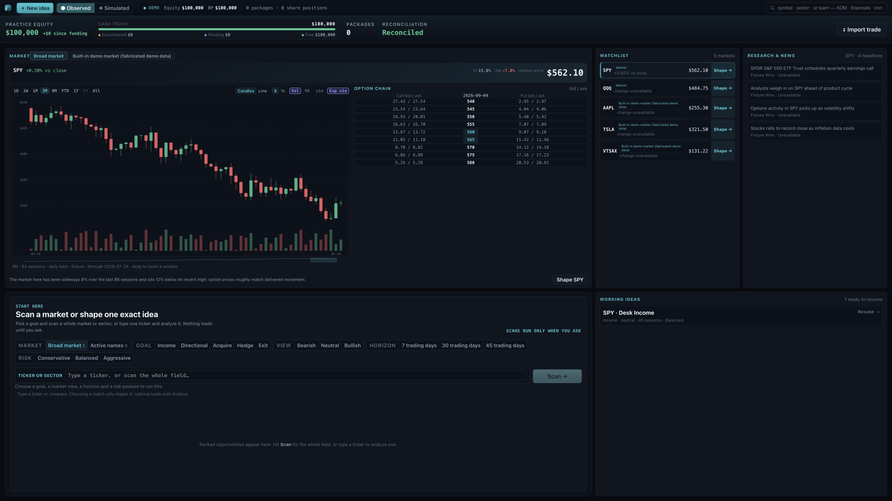

The problem is not lack of content. It is that every region keeps a fixed appetite whether it has zero, one, or many useful rows.

### 4.2 Four positions do not repair the allocation

At `2560×1440`, four positions are compressed into a narrow rail, while Watchlist, News, and one Working Idea retain much larger empty allocations. The Book fan receives a large box but uses only a narrow plot-and-label band. The workbench and Book compete for the bottom row rather than adapting around actual content.

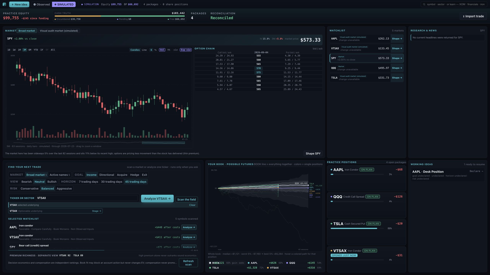

At the owner’s effective `2000×963` viewport, the positions become thinner, the workbench loses its result rows, and one Working Idea still owns a large mostly empty region.

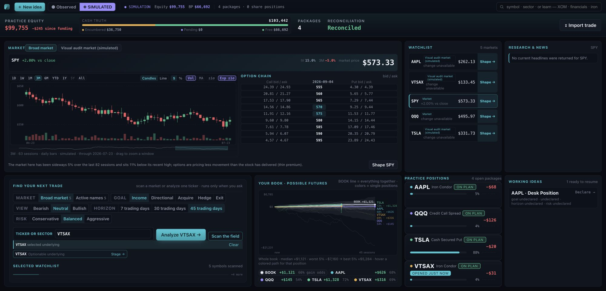

### 4.3 Mobile Home has both clipping and the wrong scroll owner

At `390×844`, the permanent workbench is the first major surface, but its `Scan` action is clipped to the right. The Home board owns an internal scroll region of roughly `595px` over more than `3,000px` of content. At `320×700`, the board’s scroll width is about `433px` inside a `311px` content box.

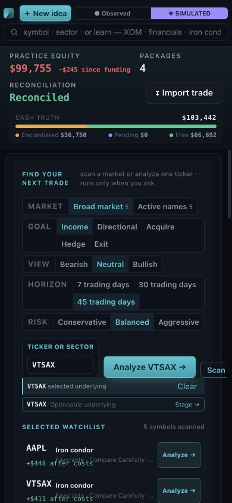

Mobile is not merely “dense.” It has hidden horizontal content and an app-within-an-app scrolling model.

### 4.4 Scout works at 2560 and becomes unusable at 2000

At `2560×1440`, Scout results are visible and include direct Analyze actions:

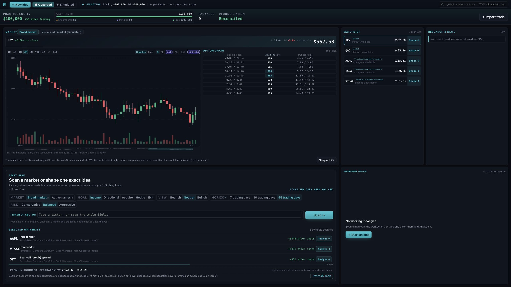

At `2000×963`, `.scoutresults` retains a small outer height, but its nested `.opportunityrows` collapses to zero client height while retaining about `247px` of scroll content. The first result exists in the DOM, but center-point hit testing lands on its parent panel rather than the row. A programmatic click at this viewport did nothing; the same action worked after widening to 2560.

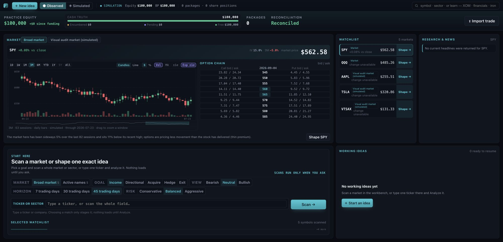

This is not a streaming-engine problem. The backend already emits NDJSON progressively. It is a result-owner and CSS problem.

### 4.5 New Idea is the strongest surface, but wide height pressure deletes facts

At `2560×1440`, New Idea is coherent enough to preserve. It shows the candidate field, exact payoff, scenarios, market data, the fan, and execution dock:

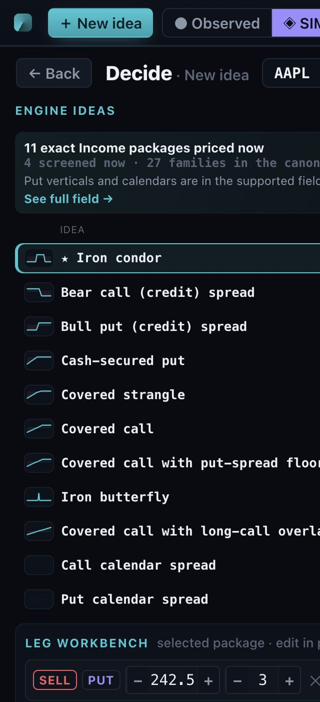

At `2000×963`, a height-only media rule removes `.ksecondary` and `.marketctx`. Max-profit/capital/breakeven context and the exact chain/news context disappear rather than recomposing. The left column shows only part of the four-leg package, the risk map becomes a small inset, the market chart is barely legible, while the fan still owns a very large fraction of the screen.

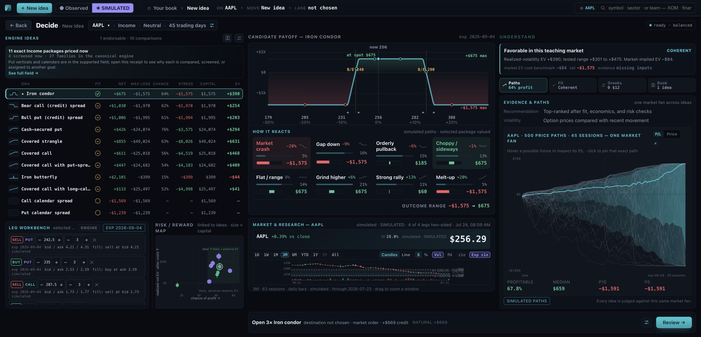

At `1440×900`, the application keeps three desktop columns. The fan is only about `120px` tall, the market chart is unreadable, the fourth leg is not visible, and 115 visible actions are below one of the recommended touch dimensions.

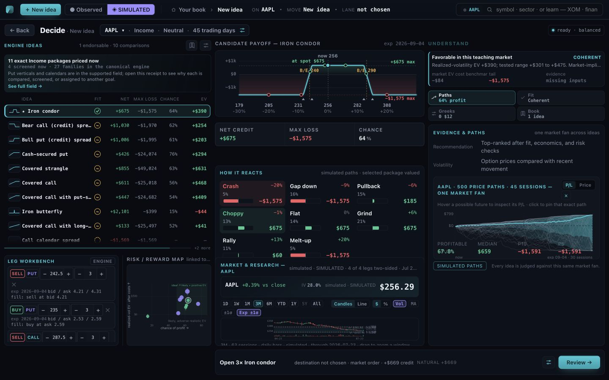

At mobile width, candidate names and facts are truncated, the first leg consumes most of the first screen, and the deep-analysis hierarchy is lost.

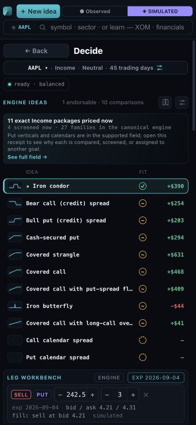

The owner-supplied observed-state capture shows additional state-specific collisions that the simulated state did not produce: market footer headings overlap the chart receipt, and Evidence & Paths labels collide.

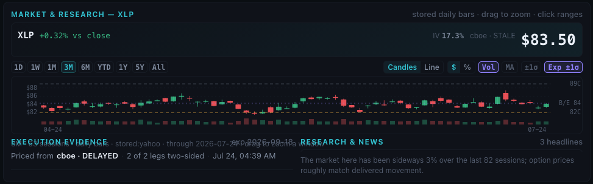

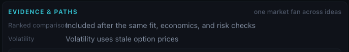

### 4.6 Leg hierarchy remains backwards

The owner’s close-up shows expiry, fill prose, IV, delta, provider, and freshness competing with strike and executable bid/ask:

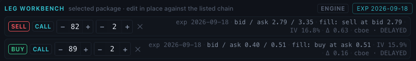

At wide desktop this is still repeated per leg. At narrower widths, the metadata wraps or truncates. Same-expiry and same-provider facts are repeated four times, while the exact executable book—the fact needed to judge the package—loses space.

### 4.7 Scenario tiles and playback still use prose and tiny Unicode controls

The resting New Idea tiles repeat eight static descriptions. Selecting a scenario inserts a narrative line and controls into the same fixed-height panel:

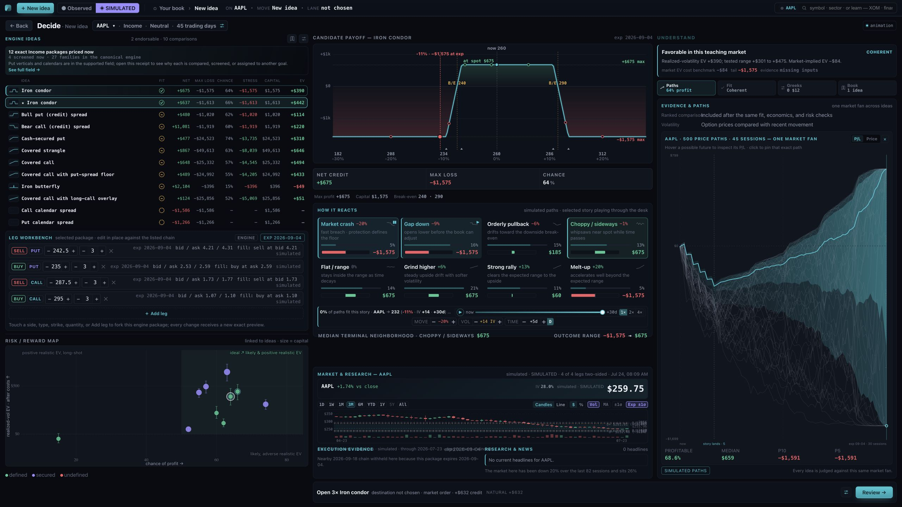

Measured on the current build:

- playback button: about `21×21px`;
- scenario `+`/`−` buttons: about `18×20px`;
- leg steppers at wide desktop: about `22×26px`.

The `▶`, `❚❚`, `+`, and `−` characters are text glyphs, so mathematically centering their boxes does not make them optically consistent.

### 4.8 Position fills a wide screen but does not converge cleanly

At `2560×1440`, Position uses the canvas better than Home. It should be the basis for convergence, not discarded:

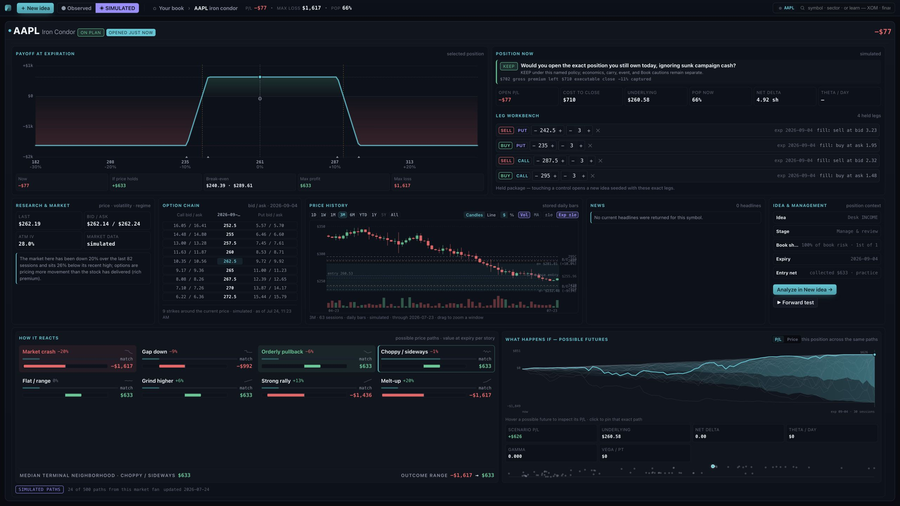

But the same screen visibly demonstrates a contract problem: Home showed theta around `$11/day`; Position’s top `THETA / DAY` receipt rendered `—` before the lower scenario panel later showed `$12`. The code audit explains this as two Greeks wire shapes and a frontend overwrite.

At `2000×963`, the bottom scenario/fan row is only partially visible and the management rail gains its own scrollbar:

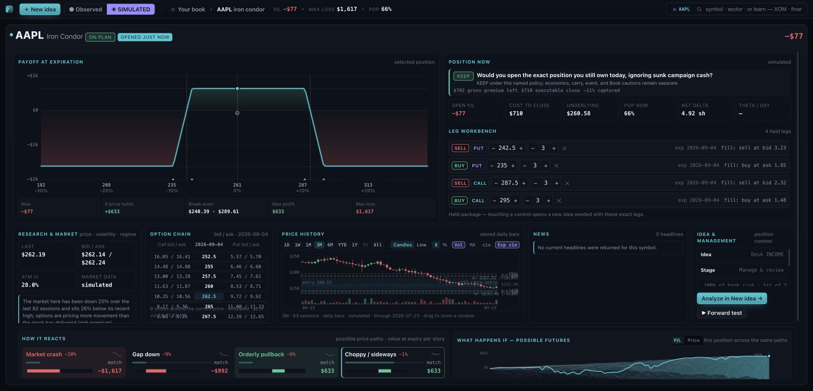

At `390×844`, the header P/L is clipped at the right edge, the position is nested in a tall internal scroll surface, and the first viewport reaches only the top of Position Now:

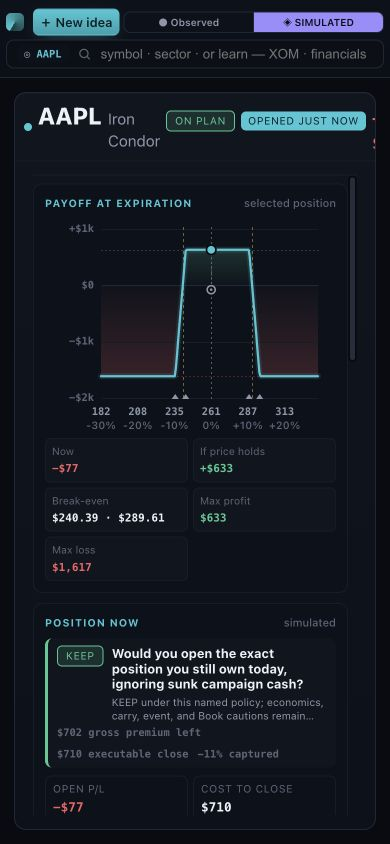

`Forward test` does not produce a durable result or clear progress. It moves the internal viewport into another scenario state and leaves the user to infer what happened:

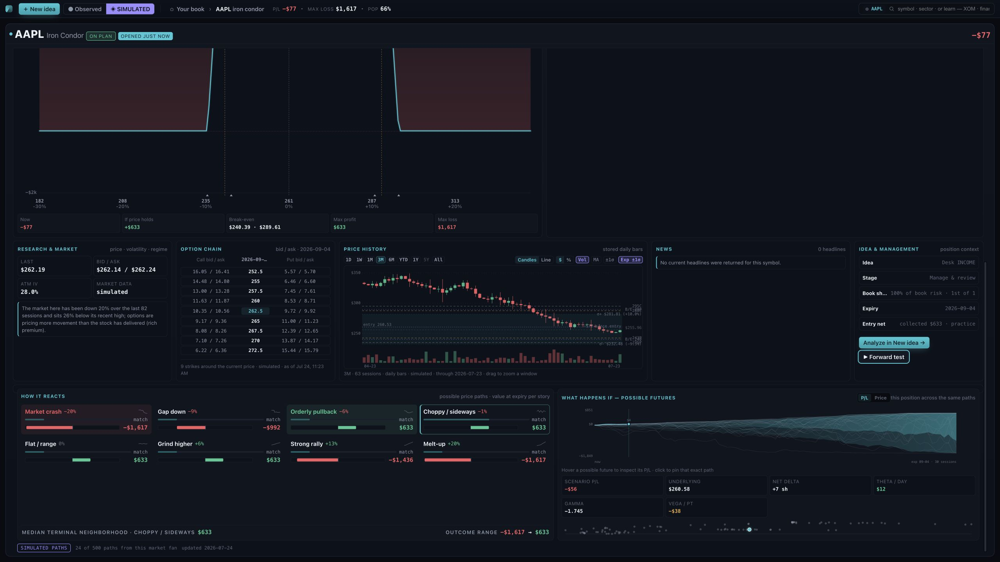

`Analyze in New idea` does not preserve the exact held package and management declarations. It opens a mostly blank declaration state:

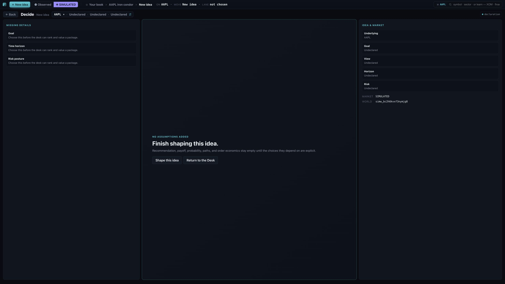

### 4.9 Implementation language is still presented as product value

The owner’s capture correctly calls out `27 families in the canonical engine` and the large dark receipt:

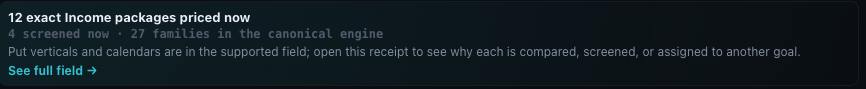

The user needs to know what strategies were considered, what was excluded, and why. They do not need the internal registry count or the phrase “canonical engine.”

## 5. P0: correctness and trust failures

These precede layout polishing. A beautiful surface that can show a fabricated or mis-unitized number is not releasable.

### 5.1 Restore truthful CI before accepting another “green” claim

`.github/workflows/ci.yml` invokes scripts that no longer exist:

- `test:defaults`
- `test:scenario`
- `test:spa`
- `test:journeys`
- `test:seeded`
- `test:audit`
- `test:bookrisk`
- `test:adoption`
- `test:learn:coverage`

The current `dom-tests/package.json` only defines:

- `test`
- `test:desk`
- `test:auth`
- `test:ci`

This is structural dead CI, not flakiness. The current Desk suite also serves raw source and mocks the backend; despite its package description, it is not a complete packaged-jar browser lane.

CI must be repaired first because every subsequent “verified” claim depends on it.

### 5.2 Fix the three confirmed rendering regressions

The developer independently confirmed all three:

1. `candCollect()` now returns `null`, but callers compare it numerically. JavaScript coerces `null >= 0` to `true`, and `signed(null)` becomes `+$0`.
2. `if (sv == null) { return; }` inside the payoff scenario loop exits the entire `drawPayoff()` renderer. One missing scenario value can remove all later markers and annotations. It must skip only that scenario.
3. `observedAt` is epoch milliseconds, but the renderer treats it as an ISO string. The current order controls visibly render `1784913960000`.

The owner supplied the `+$0` evidence:

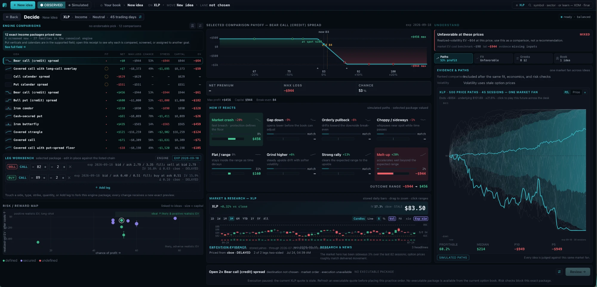

The private order-control capture includes the raw epoch:

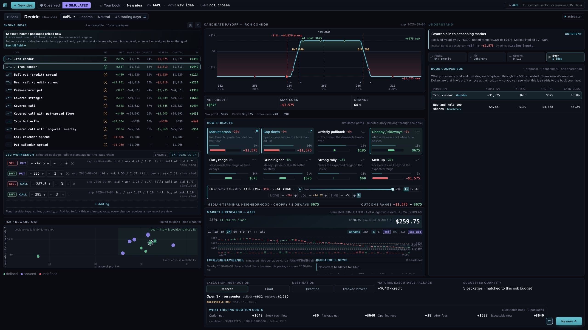

The correct summary of `e090c73` is:

> One package-price receipt is published, but it is not yet the one authority consumed everywhere.

### 5.3 Canonicalize Greeks at the wire contract

Two backend shapes still represent the same Greeks:

- `TradeView.greeks` uses canonical named units.
- `TradeDetail.current.greeks` uses `TradeService.PositionGreeks` fields such as `gammaShares`, `thetaPerDay`, and `vegaPerPoint`.

On detail load, `index.html` replaces the canonical object with `current.greeks`, then the renderer asks for canonical fields such as `gammaSharesPerDollar` and `thetaCentsPerDay`.

Required correction:

- serialize the canonical `GreeksView` from `MarkView` and per-leg receipts;
- delete the alternate wire shape;
- remove every frontend normalizer or fallback between schemas;
- add exact rendered assertions for delta, gamma, theta, and vega across Home, New Idea, and Position.

### 5.4 Use one held-payoff receipt

Held payoff is currently returned twice:

- `TradeView.terminalPayoff`;
- `TradeDetail.payoff`.

The frontend first consumes one and later replaces it with the other. Delete the second shape and use `RiskProfile.TerminalPayoff` everywhere.

`If price holds` is also interpolated from the curve in the browser and published as a financial fact. The backend should return `terminalPnlAtCurrentSpotCents` from the same price/evidence snapshot. Browser interpolation remains acceptable for drawing pixels, not for originating the displayed number.

### 5.5 One batch-quote authority

Single-symbol Research already returns a display price, display change, basis/fallback, source, freshness, and as-of. Batch quotes do not use the same typed receipt, so Home rebuilds authority from `last` and previous close.

Both observed and simulated `/api/quotes` rows should return one `QuoteView`. Delete `quoteContextRow()` as a second price decision.

### 5.6 Stop deriving Book share and rank in JavaScript

Home calculates each position’s share from `trade.maxLoss / portfolio.totalMaxLoss`, sorts it, and publishes both Book share and rank.

The existing heat/roster receipt should return:

- per-trade risk amount;
- declared denominator/basis;
- percentage;
- ordinal rank.

This extends the existing Book-risk owner. It does not create a new calculator.

### 5.7 Retain the separate EV lenses, but make precedence unambiguous

The current review can say:

- realized-volatility EV is favorable;
- the market-implied model expects a loss;
- a checkbox is required because the market-implied result is negative.

Both lenses can be valid. The UI needs one stable receipt:

| Lens | Value | Meaning |
|---|---:|---|
| Market-implied | exact result | cost/risk-neutral benchmark |
| Realized-volatility | exact result and sensitivity | outcome under observed realized-volatility assumptions |

Only one lens may control endorsement, and that authority must be visually explicit.

### 5.8 Preserve the corrected missing-evidence and holdings semantics

Current runtime correctly withheld Hedge candidates requiring shares:

> No eligible held shares of AAPL — a hedge acts on a position you already own; candidates that would require buying shares are withheld.

Do not regress this while consolidating the Home workbench.

Likewise, lifecycle verdicts must continue to require adequate current evidence. Missing marks must produce `CURRENT MARK UNAVAILABLE`, not `DEFEND`, `KEEP`, or `ACTION REQUIRED`.

## 6. One workspace context and one transition grammar

The application has storage for workspace state, but this Desk does not use it as its single owner. Current private state is split across Home declarations, market focus, sector scope, Decide state, Book state, and route state.

Observed failures:

- `Import trade` showed a Book loading skeleton, returned to Home, and cleared goal, view, horizon, risk, and the selected world indicator rather than exposing a stable import journey.
- `Analyze in New idea` from Position opened a blank AAPL New Idea with goal, view, horizon, and risk undeclared instead of preserving the exact held legs and management intent.
- On a cold built-in-demo boot, the top mode presented Observed as selected while the account/header and market receipt said Demo/fabricated.
- A Scout result carries a precise strategy and evaluation, but Home sends only the symbol into New Idea and recomputes the field.

Define and persist one versioned `WorkspaceContext` using the existing Workspace API:

- market lane/world;
- scope: broad market, active universe, sector, or exact symbol;
- canonical sector key;
- focused subject: Book, held position, proposed package, or market;
- goal;
- view/direction;
- horizon;
- risk posture;
- held/proposed identity;
- route/focus state;
- prior focus for Back.

Required transition behavior:

- Home Scout row → New Idea with exact evaluation/package identity and declarations.
- Position → New Idea with exact held legs, quantity, source position, and management declaration.
- New Idea → Home returns to the exact prior sector, market focus, workbench state, and scroll position.
- World change clears all market-owned artifacts, hydrates the new world, then commits the visible mode and context atomically.
- Import Trade opens its actual owner and returns without destroying unrelated workspace declarations.
- Back returns to the previous focus, not a default Home.

## 7. Home product assessment and target composition

### 7.1 Home’s job

Home is worth retaining. Its job is meta-level decision making:

- What market or sector deserves study?
- What is the Book’s cash and risk truth?
- What held position needs attention?
- What working idea should be resumed?
- What opportunity should be opened in canonical New Idea?

It should not recreate New Idea’s payoff, candidate comparison, exact legs, and full evidence rail.

### 7.2 Current Home defects

#### Fixed rectangular appetite

The CSS assigns large fixed row and panel appetites at wide widths. Zero, one, and four positions do not materially change the space granted to Positions, Working Ideas, Watchlist, or News.

#### Positions and Working Ideas are separate oversized panels

They should be one adaptive activity rail with two always-visible sections:

- **Needs attention / open positions**
- **Resume / working ideas**

Neither section receives more height than its useful row count until genuine overflow exists.

#### Book possible futures spends pixels on labels and empty plot

With four positions, the labels cluster at the plot’s right edge. The legend, line labels, and Book receipts compete with the fan. Use one shared `PathFan` grammar:

- medians/primary traces at rest;
- bands earned by focus;
- stable swatches linked to the activity rail;
- Book risk receipts outside the plot;
- no sentence explaining the legend when an actual legend can do the job.

#### Market chart and chain are not proportioned by information

The chart receives a very large canvas. The chain receives a short nearby slice and then empty vertical space because it is forced to match the chart’s height.

The market region should treat chart and chain as peers:

- chart owns history and overlays;
- chain owns a useful number of strikes and direct actions;
- both resize by available width and current task;
- unused chain height is given to more strikes, expiration context, or execution evidence—not blank space.

#### Watchlist and news are passive

Watchlist focus and Shape actions work in the current build. Chain rows and news headlines are not equivalently actionable. A market row should focus or shape; a chain row should stage a strike/leg or exact idea; a headline should open its source or the focused research view.

#### Empty Home still apologizes

When no positions exist, Book space should become opportunity/redeployment context. Scout and market context should lead. No large rectangle should merely say it has nothing.

### 7.3 Target wide-desktop composition

Keep six content owners, but do not make six equal rectangles:

1. Account/cash-truth strip.
2. Market context: chart plus a useful chain.
3. Permanent Discovery workbench with stable streamed-results region.
4. Book possible futures and risk.
5. Adaptive Activity rail: positions plus working ideas.
6. Market intelligence: watchlist plus research/news.

At `2560×1440`:

- account strip spans the page;
- Market and Discovery share the upper work area, with Market larger but not dominant;
- Book, Activity, and Market Intelligence share the lower work area;
- a sparse panel relinquishes space to a populated neighbor;
- no page or panel scroll in the default composition.

At `1920×1080` and `2000×963`:

- the same owners remain visible;
- text density reduces before financial facts disappear;
- only the one genuinely overflowing list may scroll;
- no height-only rule hides a receipt or market context.

At `1440`, `1280`, and `1000`:

- use deliberate two-column or stacked compositions;
- do not squeeze three deep-analysis columns into 372–495px widths;
- do not create board scroll plus list scroll plus rail scroll.

At mobile:

1. account/cash truth;
2. Discovery;
3. focused market summary and actionable chain;
4. Activity;
5. Book futures;
6. Watch/news.

One page-level scroller owns the experience. No horizontal overflow is allowed.

## 8. Scout assessment

### 8.1 What works

- NDJSON streaming is real.
- Results can be emitted before the full field completes.
- The existing `OpportunityScanner`, `AutoRecommender`, `CompensationView`, `StrategyCatalog`, and `PortfolioOptimizer` already provide the engine capability.
- Broad-market and active-universe scopes exist.
- A result can launch canonical New Idea.

### 8.2 What remains broken

#### The UI does not patch one arriving row

The markup owns `.scoutresults`, while the patch path looks for `.scoutresultcard`. Partial updates therefore replace the whole result region rather than adding/updating a stable row.

#### Results can be present but not usable

At `2000×963`, result rows have content but zero usable height and fail hit testing.

#### Progress counts change meaning

The backend’s single `completed/total` pair changes denominator across phases. The UI cannot honestly say what has completed.

Return and display separate counts:

- universe considered;
- evidence-complete/eligible symbols;
- packages evaluated;
- rows retained;
- current phase and phase progress.

#### Exact package identity is lost

The frontier already carries `evaluationId`, strategy identity, economics, and Book effect. Home deduplicates by symbol and sends only the symbol to New Idea.

Extend the existing Plan strategy-copy/adoption mechanism so a Scout row adopts its immutable evaluation into a new Plan. Do not create a Scout mini-analysis API.

#### Rows mix four judgments without hierarchy

Current copy can read:

> Favorable · Compare Carefully · Book Worsens · Non Observed Inputs

Use four named lanes:

- after-cost economics;
- evidence/events;
- compensation;
- destination Book effect.

No lane overwrites another, and endorsement authority remains explicit.

#### Compensation percentages can be absurd

The private scan rendered annualized figures over `4,000%` and `5,000%` on “risk capital.” Those may be arithmetic outputs from a narrow denominator, but they are not useful as resting product facts.

Show:

- premium dollars;
- denominator named in dollars;
- holding period;
- non-annualized period return;
- annualized value only where the denominator and repeatability make it meaningful.

### 8.3 Scout target behavior

- The permanent region has stable idle, scanning, partial, complete, empty, and error geometry.
- The first completed row appears immediately without replacing Market or sector controls.
- Every row has symbol, strategy, goal, compensation, after-cost EV, evidence, Book effect, and `Analyze`.
- Every Analyze action opens the exact immutable package in canonical New Idea.
- Sector/market scope remains visible while results stream.
- A scan that finds nothing keeps optionality as the result; it does not invent a redeployment return.

## 9. New Idea assessment

### 9.1 Candidate rail

Use semantic columns:

- Net credit;
- Net debit;
- Capital required;
- Maximum loss.

Do not overload `Collect`, `Net`, or a signed field across stock-inclusive and option-only packages. `Unavailable` must remain unavailable; it must never become `+$0`.

The candidate field should state:

- packages priced;
- packages screened;
- exact reasons for exclusion;
- access to the full field.

Delete internal language such as `27 families in the canonical engine`.

### 9.2 Leg workbench

For a same-expiry desktop package, a row should read approximately:

`SELL PUT   242.5   ×3      bid 4.21 | ask 4.31`

Rules:

- strike is primary;
- quantity is secondary;
- bid/ask is complete;
- executable side is highlighted;
- side/type is one compact semantic control;
- same expiry appears once in the panel header;
- provider/freshness appears once per package unless a leg differs;
- leg expiry appears only when it differs, as in calendars and diagonals;
- IV/delta is secondary detail when room exists;
- `fill: sell at bid…` prose is removed because the highlighted executable side already communicates it.

Mobile uses two complete lines:

1. side/type, strike, quantity, edit/remove;
2. full bid/ask and executable price.

The same `LegRow` consumes the same typed receipt in New Idea and Position.

### 9.3 Inline editing

Inline editing should be canonical where feasible:

- strike;
- quantity;
- side/type when structurally valid;
- add/remove leg;
- expiration for multi-expiry packages.

Edits produce a new exact preview through the existing backend. They do not invoke browser pricing and do not require a separate leg-editor screen.

### 9.4 How It Reacts

Resting tiles should contain only:

- story name;
- move;
- trajectory glyph;
- match/probability;
- P/L bar and exact P/L.

Remove the eight repeated generic descriptions. If education is needed, show one selected-story explanation after interaction.

Use one `ScenarioSpectrum` for New Idea and Position. Surface layout controls composition; the component owns its internal geometry.

### 9.5 Playback controls

Replace the narrative ribbon with:

- play/pause;
- timeline;
- endpoint;
- speed;
- move;
- volatility;
- time;
- a small match badge.

Replace Unicode glyphs with canonical SVG icons. Use one `IconButton` and one `Stepper`:

- consistent optical center;
- desktop density variants through variables;
- minimum `40–44px` touch target on mobile;
- accessible labels.

### 9.6 Paths, Fit, Greeks, and Book

Paths:

- must keep a useful fan at all desktop widths;
- must not own an internal scroller at full desktop;
- must not disappear when animation is pending;
- retains the shared-ensemble contract.

Fit:

- currently becomes a wall of repeated prose;
- collapse it into named checks with exact receipts;
- detailed methodology belongs in one on-demand disclosure.

Greeks:

- consumes one canonical wire shape;
- never switches units or field names by surface.

Book:

- identifies populations precisely (`1 proposal · 1 benchmark`, not “3 compared”);
- does not say “what you already hold” when no held package participates;
- uses the same ensemble and named comparison receipt.

### 9.7 Market and execution panel

The market panel currently has competing `.decmarketwide` and `.decmarketband` grammars, plus the height-only rule that hides `.marketctx`.

Unify it into one `MarketContext`:

- quote;
- history;
- expected-move receipt;
- exact package execution evidence;
- nearby chain;
- news.

Each is an independent receipt and settles independently. Missing quote cannot hide stored history; missing news cannot hide chain; stale chain must name its state.

### 9.8 News

The current New Idea code slices three headlines. `+N more` must be an action:

- expand the one owning news list;
- open focused research;
- or scroll the one intentional list.

Decorative overflow counts are not acceptable.

## 10. Position assessment

### 10.1 Preserve the fresh-eyes doctrine

The current question is correct:

> Would you open the exact position you still own today, ignoring sunk campaign cash?

Keep it, but every verdict must cite its named trigger and adequate current evidence.

### 10.2 Fix contract divergence

The visible theta mismatch is the strongest example. Position must consume:

- the same Greeks;
- the same payoff;
- the same current price receipt;
- the same expected-move receipt;
- the same scenario checkpoints;
- the same market context.

It should not replace canonical summary receipts with detail-specific shapes.

### 10.3 Held legs and management action

The current leg area looks editable, then says touching a control opens a New Idea. Replace ambiguous duplicated instruction with one explicit action:

`Edit as new idea →`

If inline management edits are allowed, make them explicit and route them through one exact preview. Otherwise render held legs as receipts and provide one edit action.

### 10.4 Forward Test

Forward Test needs:

- explicit start/progress;
- the dataset/model identity;
- completion state;
- durable result;
- comparison to the current lifecycle receipt;
- error/unavailable state.

Merely activating a scenario path is not a forward test.

### 10.5 Position-to-New-Idea

The transition must preserve:

- exact held legs;
- quantities;
- expiration(s);
- source position/trade ID;
- current goal/management intent;
- horizon;
- risk posture;
- market/world.

The current blank declaration screen violates the label on the action.

### 10.6 Position responsive order

Mobile order:

1. evidence availability and verdict;
2. current economics;
3. management actions and legs;
4. market/chain;
5. scenarios/paths;
6. research/news.

One page scroller owns the experience. No nested panel scrollbars.

## 11. Market, history, chain, and research

### 11.1 Daily ranges

Current behavior is honest:

- `1D` = one daily session;
- `1W` = five daily sessions.

The receipt already discloses that fact. To remove the remaining ambiguity, rename the controls to `1 session` and `5 sessions` when no observed intraday dataset exists. Do not fabricate intraday bars.

### 11.2 Expected move

The old client-generated parabola is resolved. The current code draws backend p16/p50/p84 terminal rails from the Research receipt. Preserve this single owner.

### 11.3 Chain actionability

Home’s chain is primarily a passive table. Rows should support:

- focus strike;
- stage call/put side;
- open exact New Idea declaration;
- preserve expiration and market context.

Use the existing chain and preview owners; do not create a Home-chain calculator.

### 11.4 Market focus

Watchlist focus worked in the private test: selecting AAPL updated the market chart and receipts. Preserve that behavior and bind it to `WorkspaceContext`.

Sector identity must come from the universe catalog. Browser-only aliases, hardcoded ETF regexes, default order, twelve-symbol caps, and silent nearest-30-session expiration choices must become explicit persisted preferences or backend catalog facts.

### 11.5 News actionability

Headlines and `+N more` need real actions. Source, timestamp, and evidence state remain visible. Implementation notes such as `same owners as Home` do not.

## 12. Visual system and the one-app.css requirement

The CSS extraction is real: the current document links one external `app.css` and contains no `<style>` block.

That does not mean CSS is consolidated:

- `app.css`: 3,687 lines;
- 86 `@media` blocks;
- 61 explicit `overflow:auto`/`scroll` rules;
- 12 `!important` declarations;
- 57 inline `style=` attributes in `index.html`.

The worst current rule is height-only:

```css
@media (min-height:851px) and (max-height:999px) { … }
```

It has no width bound, so it can affect a `390×900` phone and a `2000×963` desktop. It hides `.ksecondary` and `.marketctx`, deleting facts rather than recomposing them.

Keep one physical `app.css`, but organize it into one authority:

```css
@layer reset, tokens, primitives, components, surfaces, responsive, utilities;
```

Rules:

- one token set for surface, text, border, accent, positive, negative, warning, stale, and unavailable;
- one implementation of panel, row, selected row, segmented control, badge, receipt, icon button, stepper, empty state, and overflow list;
- components own internal geometry, preferably through container queries;
- viewport media queries own page composition only;
- no hardcoded black-label backgrounds such as Home-specific `#131a24`;
- inline `style` is limited to safe CSS custom-property data used for drawing;
- no property is redefined through a long surface-specific override chain;
- no responsive rule may hide an exact financial receipt to make the layout fit.

## 13. Communication and copy audit

### Keep explicit text

- exact values and units;
- strikes, bid/ask, quantity, P/L, EV, POP, Greeks;
- provenance and freshness;
- missing-data reasons;
- named lifecycle triggers;
- execution blockers;
- policy/version identity where it changes a decision;
- legal and educational disclosures.

### Replace with visual grammar

| Current copy | Replacement |
|---|---|
| Eight generic scenario descriptions | trajectory glyph + move + match + P/L |
| `BOOK line = everything together · colors = single positions` | actual legend with swatches |
| `linked to ideas · size = capital` | size legend |
| narrative playback sentence | timeline, endpoint, match badge |
| market-regime paragraph at rest | momentum, distance-from-high, IV-vs-realized chips |
| repeated move/vol/time words | labeled graphical controls with exact values |

### Move to one on-demand disclosure

- educational strategy stories;
- provider methodology;
- model interpretation;
- first-use interaction coaching;
- policy detail beyond the named trigger.

### Delete

- `canonical engine`;
- `same owners as Home`;
- `one market fan across ideas`;
- `the top bar shows freshness`;
- repeated same-expiry/source/freshness;
- duplicated touch/click instructions;
- sentences that merely restate a visible heading or button.

## 14. Duplication and ownership inventory

| Fact/component | Current competing owners | Required single owner |
|---|---|---|
| Package price | typed receipt plus legacy fields/caller fallbacks | one typed package-price receipt |
| Money semantics | `money`, `signed`, inline prefixes, cents/dollars variants | one cents unit plus semantic renderers |
| Position Greeks | canonical `GreeksView` plus `PositionGreeks` wire shape | one backend `GreeksView` |
| Held payoff | `TradeView.terminalPayoff` plus `TradeDetail.payoff` | one `RiskProfile.TerminalPayoff` |
| `If price holds` | frontend interpolation | backend exact receipt |
| Quote display authority | Research receipt plus Home reconstruction | one typed `QuoteView` |
| Book share/rank | frontend calculation | existing Book heat/roster receipt |
| Workspace context | Home, Decide, Book, market, and route globals | persisted `WorkspaceContext` |
| Scout handoff | immutable evaluation plus symbol-only recomputation | Plan adoption of exact evaluation |
| Path fan | three renderers for Idea, Position, Book | one `PathFan` |
| Risk map | multiple surface renderers | one `RiskMap` with typed points |
| Leg row | candidate editor, held legs, historical package views | one `LegRow` family |
| Scenario spectrum | shared markup plus conflicting surface CSS | one `ScenarioSpectrum` |
| Market context | Home chart/chain, New Idea market band, Position market grid | one `MarketContext` composition |
| History/chain | canonical receipts plus legacy display decisions | one receipt per domain |
| Scroll | board, inspect pane, rail, list, position surface | one page owner plus one intentional list |
| Styling | tokens plus hardcoded surface colors and late overrides | one `app.css` authority |

## 15. Backend/API gaps that should be extended—not rebuilt

Most remaining product defects are frontend. Eight narrow backend/wire-contract changes are justified:

1. Canonical `GreeksView` in position detail and per-leg detail.
2. One held terminal-payoff receipt.
3. Backend `terminalPnlAtCurrentSpotCents`.
4. Typed batch `QuoteView` for observed and simulated rows.
5. Per-trade Book risk amount/share/rank in the existing heat/roster receipt.
6. Stable Scout phase/count receipt.
7. Exact Scout evaluation adoption into a Plan.
8. Persisted `WorkspaceContext` using the existing Workspace API.

No other new engine or general-purpose API is warranted by this audit.

## 16. Browser-test and CI program

### 16.1 Keep the browser suite

The suite catches failures Java tests cannot:

- wrong local date rendering;
- state loss across navigation;
- stale world artifacts;
- clipped controls;
- invisible results;
- bad computed styles.

The answer is not deletion. It is making the suite trustworthy.

### 16.2 Split responsibilities

1. **Fast hard-blocking contracts**
   - formatters and exact rendered strings;
   - no silent defaults;
   - SPA identity/context;
   - receipt-to-text mapping;
   - no JavaScript financial fact generation.

2. **Packaged-jar journeys**
   - fresh server/browser per shard;
   - deterministic fixtures;
   - event-based waits;
   - retry once only for the journey lane;
   - screenshots and diagnostics preserved.

3. **Visual/geometry matrix**
   - required viewports and content states;
   - bounding-box and overflow assertions;
   - screenshot-diff review for large composition changes.

### 16.3 Add the missing assertions

- `unavailable` never renders `+$0`;
- exact zero semantics for P/L, cash flow, fee, loss magnitude, and unavailable;
- epoch milliseconds render as a human timestamp;
- one missing scenario value does not abort the payoff renderer;
- Home/New Idea/Position show identical POP, P/L, max loss, Greeks, price/change, and expiry for the same receipt;
- 0/1/4/12 positions;
- 0/5/20 working ideas;
- 1/2/4/6 legs;
- same and multiple expirations;
- 0/5/20 news items and an actionable overflow disclosure;
- quote/history/chain/news ready, stale, missing, and error independently;
- Scout idle, partial, complete, empty, and error;
- every action has a visible hit target;
- minimum mobile touch dimensions;
- no horizontal overflow;
- no exact fact hidden by a media rule.

### 16.4 Required viewport matrix

The browser gate must include:

- `2560×1440`
- `2048×1152`
- `2000×963`
- `1920×1080`
- `1440×900`
- `1280×800`
- `1000×800`
- `390×844`
- `375×812`
- `320×700`

`2000×963` is mandatory because it exposes the height-only deletion rule and collapsed Scout results that the nominal 1920×1080 test misses.

## 17. Sequenced implementation program

This sequence includes the full earlier plan and the new findings. It is intended to be executed through completion; later milestones are not optional.

### M0 — Repair CI and freeze golden receipts

**Work**

- Reconcile `.github/workflows/ci.yml` with actual package scripts.
- Restore or remove dead lanes explicitly.
- Split deterministic contracts from packaged journeys.
- Use fresh database/server/browser per journey shard.
- Add exact rendered-money and timestamp tests immediately.
- Create synthetic, non-personal fixtures for the complete state matrix.

**Acceptance**

- CI invokes only existing commands.
- A deliberately wrong `+$0`, epoch timestamp, or missing chart marker fails CI.
- Release evidence is generated from the exact branch tip.

### M1 — Stop every live wrong number

**Work**

- Fix null-to-`+$0`.
- Skip a missing scenario point rather than aborting `drawPayoff`.
- Format `observedAt` from its declared epoch unit.
- Canonicalize Greeks and held payoff.
- Add backend `terminalPnlAtCurrentSpotCents`.
- Canonicalize batch quote receipt.
- Move Book share/rank into the existing backend owner.
- Remove every browser calculation that originates a displayed financial fact.

**Acceptance**

- For a golden package, every surface renders exact strings matching one backend receipt.
- No fallback invents zero, price, POP, EV, P/L, Greeks, sessions, rank, or Book share.

### M2 — One workspace context and atomic transitions

**Work**

- Define and persist the versioned context.
- Bind Home, Scout, New Idea, Position, market focus, world, and Back to it.
- Preserve exact Scout and Position identities into New Idea.
- Repair Import Trade ownership and return.
- Clear and hydrate world-owned artifacts atomically.

**Acceptance**

- Every transition returns to or opens the exact intended state.
- No declaration, world, sector, position, or package identity silently resets.
- No header/body disagreement survives a transition.

### M3 — Consolidate the one-app.css architecture and shared primitives

**Work**

- Establish CSS layers and one token system inside `app.css`.
- Create one `IconButton`, `Stepper`, `LegRow`, `ScenarioSpectrum`, `EvidenceReceipt`, `StatusBadge`, `OverflowList`, `EmptyState`, `MarketContext`, `PathFan`, `RiskMap`, and `ActivityRail`.
- Migrate one surface at a time and delete the old renderer/rules after each migration.
- Replace height-only fact-hiding rules with container-aware component density.

**Acceptance**

- One component has one internal grammar.
- No exact fact is hidden for fit.
- No hardcoded Home-only black-label theme remains.
- Inline styles are limited to safe drawing custom properties.

### M4 — Refactor Home around product value

**Work**

- Implement the adaptive six-owner composition.
- Combine Positions and Working Ideas into one Activity rail.
- Let sparse regions relinquish space.
- Give the chain useful rows/actions.
- Make empty Book space productive.
- Keep persistent sector/market lens and permanent Discovery.
- Bind Watchlist and News to focused context.

**Acceptance**

- Empty, one-position, four-position, and twelve-position Home are balanced at 1920/2000/2560.
- No page or panel scroll in the default wide composition.
- Only one intentional list scrolls for genuine overflow.
- Mobile has one vertical scroller and no horizontal clipping.

### M5 — Complete Scout

**Work**

- Preserve NDJSON.
- Patch one stable row as it arrives.
- Add stable phase counts.
- Preserve exact evaluation/package identity.
- Deduplicate by symbol plus strategy identity, not symbol alone.
- Reframe the four judgment lanes.
- Correct compensation denominator presentation.
- Keep sector/market controls visible throughout the scan.

**Acceptance**

- First result appears before completion.
- Every visible result is clickable at every viewport.
- Analyze opens the exact package shown.
- No result replaces Market or sector controls.

### M6 — Consolidate New Idea

**Work**

- Rebuild candidate semantics and leg hierarchy.
- Make inline leg editing canonical.
- Remove repeated same-owner metadata.
- Compact scenario tiles.
- Replace narrative playback with graphical controls.
- Unify Paths/Fit/Greeks/Book.
- Unify the market/execution panel.
- Make news overflow actionable.
- Delete implementation copy.

**Acceptance**

- Four- and six-leg packages remain fully legible.
- All bid/ask/strike/quantity facts are visible at 1920 and 2560.
- Evidence fan remains useful at 1440 and above.
- No nested scroller at wide desktop.
- Mobile retains complete leg facts and usable controls.

### M7 — Converge Position

**Work**

- Consume shared legs, scenarios, fan, market, receipts, icons, and tokens.
- Preserve fresh-eyes semantics.
- Fix Position-to-New-Idea exact handoff.
- Implement durable Forward Test progress/result.
- Establish the mobile priority order.

**Acceptance**

- Home, New Idea, and Position show identical facts for the same receipt.
- Position-to-New-Idea preserves exact held package and declarations.
- Forward Test explains and persists what it did.
- No full-desktop inner scrollbar.

### M8 — Complete market, chain, and research interactions

**Work**

- Keep quote/history/chain/news independent.
- Rename daily ranges honestly.
- Make chain rows actionable.
- Make headlines and `+N more` actionable.
- Persist market/sector focus.
- Keep the backend expected-move owner.

**Acceptance**

- Every loader settles to ready, stale, unavailable-with-reason, or retryable error.
- Missing one receipt never blanks another.
- Every visible `+N more` opens the remaining content.

### M9 — Copy and visual-system consolidation

**Work**

- Run the keep/replace/on-demand/delete audit.
- Remove implementation language and duplicate instructions.
- Replace Unicode controls with SVG.
- Complete contrast, keyboard, focus, and accessible-label review.

**Acceptance**

- Exact facts remain explicit.
- Resting surfaces no longer narrate what their graphics and controls already show.
- Home, New Idea, and Position use one visual grammar.

### M10 — Full interaction and visual verification, then deletion

**Work**

- Exercise every action and disclosure in every state.
- Run the entire viewport/content matrix.
- Assert exact rendered strings and geometry.
- Review fresh screenshots at both primary desktop scales and mobile.
- Delete superseded state stores, renderers, helpers, CSS selectors, API fields, and compatibility paths.

**Acceptance**

- No stale-world artifact, wrong number, hidden action, clipped fact, orphan `+N more`, or horizontal overflow.
- No concept has two calculators, wire shapes, renderers, or state owners.
- All backend, deterministic browser, packaged journey, and visual matrix lanes pass from a clean build.

## 18. Non-negotiable implementation guardrails

- Do not build another recommendation, scenario, risk, lifecycle, market, or pricing engine.
- Do not perform financial calculations in the browser.
- Do not hide exact facts to make a layout fit.
- Do not solve a panel problem with another tab, sub-navigation bar, popup bloom, or nested scroller.
- Do not replace Home with New Idea; make Home an efficient meta-level workspace and route deep analysis to New Idea.
- Do not make Scout a second New Idea; preserve exact Scout identity and open canonical New Idea.
- Do not remove strategy families or recommendation capability.
- Do not spend provider budgets silently during UI work.
- Do not claim completion from code inspection alone.
- Run focused tests after every incremental module, then clean full verification.

## 19. Definition of done

The program is complete only when:

1. CI is real and trustworthy.
2. Every displayed financial fact has one backend owner and one typed receipt.
3. Home, Scout, New Idea, and Position share one workspace context and shared components.
4. Home is rich and balanced with zero, one, four, and twelve positions.
5. Scout visibly streams and every result opens the exact package.
6. New Idea retains its analytical quality without clipping, prose bloat, or tiny controls.
7. Position offers a coherent management journey and exact New Idea handoff.
8. One `app.css` contains one token/component/responsive authority rather than an override forest.
9. Default `1920×1080`, `2000×963`, and `2560×1440` compositions require no page or panel scroll.
10. Intermediate and mobile layouts deliberately recompose, use one vertical scroller, and have no horizontal overflow.
11. Every action, disclosure, loader, empty state, partial state, and error state has been used and visually verified.
12. Superseded code, CSS, wire shapes, and state stores have been deleted.

